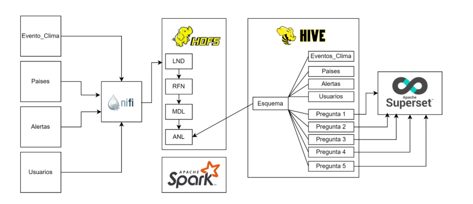
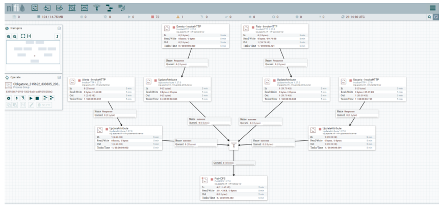
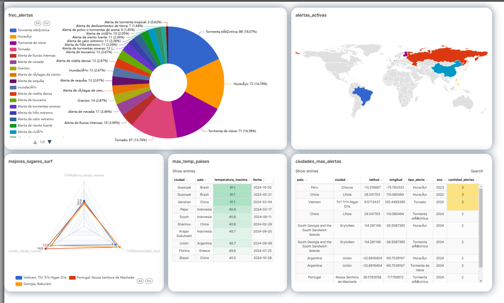

# Big Data Engineering – Climate Alert Monitoring System

## Problem
The objective of this project is to design and implement a **Big Data batch
processing architecture** to support the **monitoring of climate alerts**
and their impact on end users.

The system integrates multiple synthetic data sources, processes them through
a scalable data pipeline, and exposes the results through an analytical
dashboard oriented to **final users**.

This project was developed as the final assignment for the
**Big Data Engineering** course of the MSc in Big Data & Artificial Intelligence.

---

## Use Case
The system enables:
- Centralized ingestion of climate events and meteorological alerts
- Association of alerts with users and geographic locations
- Analytical exploration of climate alerts over time and by region
- Visualization of insights through an interactive dashboard

---

## Dataset
- **Type:** Batch
- **Volume:** Academic / synthetic
- **Source:** Synthetic datasets generated using **Mokaroo**
- **Format:** CSV

### Included datasets
The following datasets are included in this repository:
- `Usuario_v1.csv`
- `Pais_v1.csv`
- `Evento_Clima_v1.csv`
- `Alerta_meteorologica_v1.csv`

These datasets represent the core entities required to simulate
a climate alert monitoring scenario.

---

## Architecture Overview
The solution follows a classic Big Data architecture composed of ingestion,
storage, processing, and visualization layers.

**Main components:**
1. **Data ingestion** using Apache NiFi
2. **Distributed storage** in HDFS
3. **Data modeling and querying** using Hive (via HUE)
4. **Batch processing and transformations** with Apache Spark
5. **Analytics and visualization** using Apache Superset

---

## Technologies
- **Data Generation:** Mokaroo
- **Version Control:** GitLab
- **Ingestion & Orchestration:** Apache NiFi
- **Storage:** HDFS
- **Query Layer:** Hive / HUE
- **Processing Engine:** Apache Spark
- **Visualization:** Apache Superset

---

## Pipeline Description
- CSV datasets are ingested in batch mode using Apache NiFi
- Data is validated and loaded into HDFS
- Hive external tables are created over raw datasets
- Spark jobs perform analytical transformations and aggregations
- Curated datasets are exposed to Superset for visualization

The resulting curated datasets are then exposed to the visualization layer.

## Dashboard
The final output of the system is an **interactive dashboard**
designed for **end users**, allowing them to:
- Monitor climate alerts by country and time period
- Analyze alert frequency and distribution
- Explore climate-related trends interactively

A PDF export of the final dashboard is available in the `dashboards/` folder.
Additionally, Superset dashboard configuration files (`.yaml`) are included
under `dashboards/superset_export/` for versioning and reproducibility.

---

## Repository Structure

bigdata-engineering/
├── notebooks/ # Spark / analytical notebooks
├── nifi/ # Apache NiFi flow definition
├── dashboards/ # Superset dashboards (PDF / exports)
├── data/ # CSV datasets
├── assets/ # Architecture and pipeline diagrams
└── README.md

---

## Notes
This project demonstrates:
- End-to-end Big Data batch architecture design
- Practical use of industry-standard Big Data tools
- Integration of ingestion, storage, processing, and visualization layers
- Engineering-oriented thinking applied to an analytical use case

