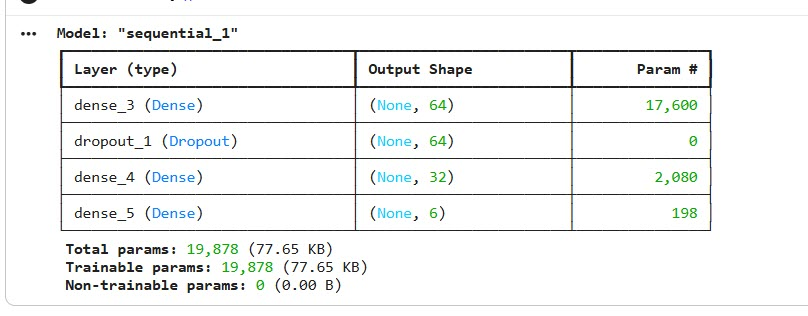
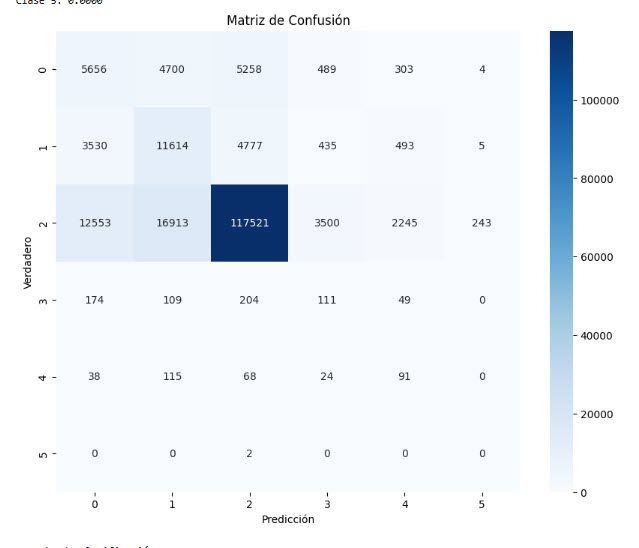

# Deep Learning – Crime Status Prediction (LAPD)

## Problem
The objective of this project is to build a **deep learning classification model**
capable of predicting the **status of a crime case** from structured,
real-world crime data.

This project was developed as the final assignment for the **Deep Learning**
course of the **MSc in Big Data & Artificial Intelligence**.

---

## Dataset
- **Source:** *Crime Data from 2020 to Present* (LAPD / Los Angeles Open Data)
- **Target variable:** `Status Desc`
- **Task:** **Multiclass classification**
- **Features:** Tabular features (mix of categorical and numerical variables), encoded for modeling

The dataset is **not included** in this repository due to size constraints.
See `data/README.md` for details.

---

## Methodology
- Data cleaning and preprocessing
- Encoding of categorical variables (e.g., one-hot encoding) and scaling where needed
- Train/test split
- Addressing class imbalance using oversampling techniques (**SMOTE / ADASYN**)
- Training a **Multilayer Perceptron (MLP)** using **TensorFlow / Keras**
- Evaluation using classification metrics and ROC-AUC

---

## Model Architecture
- **Framework:** TensorFlow / Keras
- **Type:** Fully connected neural network (MLP)
- **Output:** Softmax layer for multiclass prediction
- **Loss:** `categorical_crossentropy`
- **Metric:** `accuracy`




(See the notebook for full implementation details and hyperparameters.)

---

## Results
Key results reported in the notebook:

- **Accuracy (global): ~69.99%**
- **ROC-AUC: ~0.7260** (reported as an additional metric)
- Performance is affected by **class imbalance**, with weaker results on minority classes despite oversampling.

### Training dynamics


### Model performance


---

## How to Run
1. Install dependencies:
   ```bash
   pip install -r requirements.txt
2.Download the dataset (see data/README.md) and update the dataset path inside the notebook if needed.
3.Open and run:
notebooks/obligatory_deep_learning.ipynb

## Notes

This project demonstrates an end-to-end deep learning workflow on real-world tabular data,
including preprocessing, handling imbalanced classes, model training, and evaluation.
