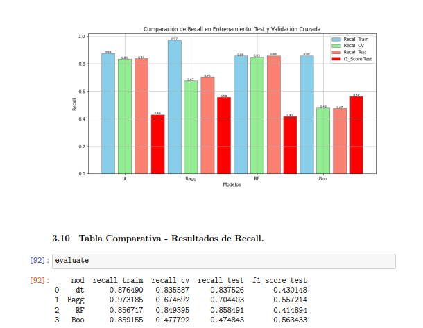

# Supervised Machine Learning – Poverty Classification (Uruguay)

## Problem
The objective of this project is to build a **binary classification model**
capable of identifying whether an individual is **poor or not poor**, based on
socioeconomic characteristics collected through a national household survey.

This project addresses a socially relevant problem, where **false negatives
(i.e. failing to identify a poor individual)** may have significant negative
implications for the design and implementation of public policies.

The project was developed as the final assignment for the
**Supervised Machine Learning** course of the MSc in Big Data & Artificial Intelligence.

---

## Dataset
- **Source:** *Encuesta Continua de Hogares (ECH) – Uruguay, 2022*
- **Type:** Public national household survey
- **Task:** Binary classification (poor vs. non-poor)
- **Features:** Socioeconomic and demographic variables

The dataset is publicly available and provided by national statistical authorities.
Details on how to obtain it are described in `data/README.md`.

---

## Methodology
The project follows a classical supervised learning workflow:

- Data preprocessing and feature selection
- Handling class imbalance
- Train / test split and cross-validation
- Training and comparison of multiple supervised learning algorithms
- Model selection based on recall-oriented evaluation

---

## Models Evaluated
The following supervised learning models were implemented and compared:

- Logistic Regression  
- K-Nearest Neighbors (KNN)  
- Naive Bayes  
- Decision Tree  
- Random Forest  
- Bagging  
- Boosting  

---

## Evaluation Strategy
Given the nature of the problem, **recall** was chosen as the **primary
evaluation metric**.

Maximizing recall is critical in this context, as it ensures that the largest
possible number of individuals living in poverty are correctly identified,
minimizing false negatives.

---
## Experimental Scope

In addition to the final model comparison, several exploratory experiments
were conducted to assess the behavior of different learning strategies:

- Baseline comparison between **Naive Bayes** and **Logistic Regression**
- Evaluation of ensemble methods:
  - Decision Tree
  - Bagging
  - Random Forest
  - Boosting
- Analysis of **oversampling and undersampling** techniques to address class imbalance
- Application of **stacking** strategies on both baseline and ensemble models

These experiments provided valuable insights into model stability and
generalization. However, only the most representative results are presented
below to maintain clarity and focus on the final model selection.


## Results and Model Comparison

### Recall comparison across models


- **Random Forest (RF)** achieved a **high and consistent recall** across
  training (0.8567), cross-validation (0.8494), and test (0.8585).
- This consistency indicates good generalization and limited overfitting.
- **Decision Tree** showed similar behavior but slightly lower recall on the test set.
- **Bagging and Boosting** models exhibited a significant drop in recall between
  training and validation/test sets, indicating overfitting.


---

## Selected Model Performance

### Random Forest - Stacking vs Oversampling vs Undersampling


The **Random Forest** model was selected as the final model due to its balance
between recall performance and generalization.

---

## Conclusion
In the context of poverty prediction, **maximizing recall is more important than
optimizing overall accuracy or F1-score**, as failing to identify individuals in
poverty can have serious social and policy implications.

The Random Forest model provides the best trade-off between recall consistency
and robustness, making it the most suitable choice for this application.

---

## How to Run
1. Install dependencies:
2. Obtain the ECH 2022 dataset (see data/README.md)
3. Open and run:

notebooks/supervised_ml_final.ipynb
   ```bash
   pip install -r requirements.txt


## Notes

This project demonstrates:

- Formulation of a real-world supervised classification problem
- Metric-driven model comparison and selection
- Responsible application of machine learning to a social impact problem
