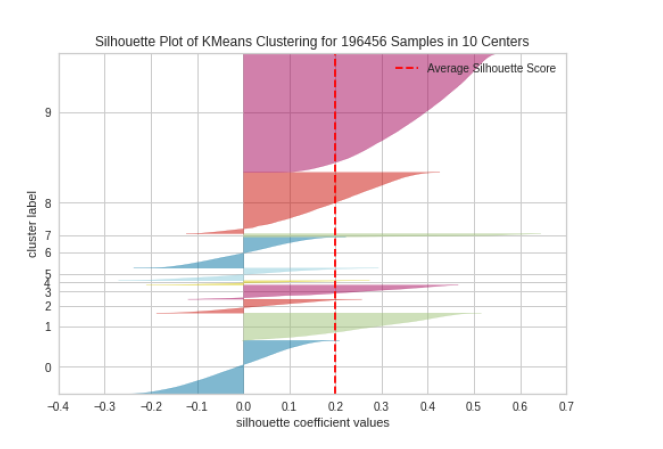
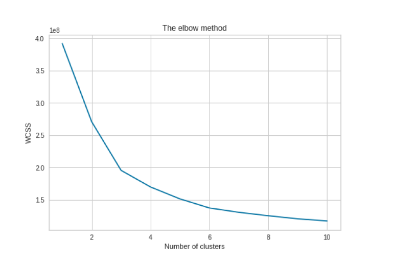
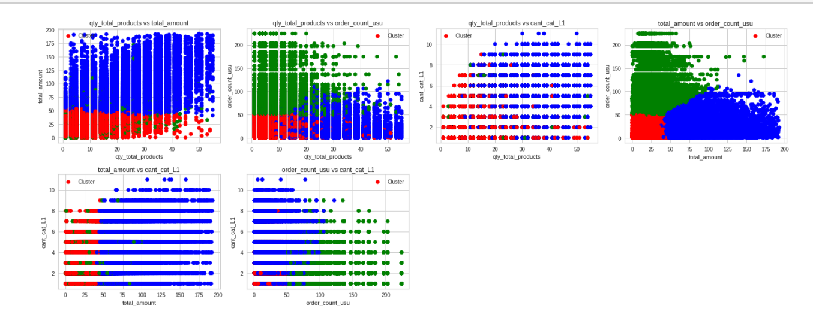

# Unsupervised Machine Learning – Order Segmentation (PedidosYa)

## Problem
The objective of this project is to identify **different types of purchase orders**
using **unsupervised learning techniques**, in order to detect **business
development opportunities** for supermarkets managed through **PedidosYa**.

By grouping orders based on behavioral, contextual, and transactional features,
the project aims to uncover latent patterns that can support decision-making
in areas such as promotions, user targeting, and operational optimization.

This project was developed as the final assignment for the
**Unsupervised Machine Learning** course of the MSc in Big Data & Artificial Intelligence.

---

## Dataset
The analysis is based on **real-world, anonymized tabular data** from
PedidosYa, describing purchase orders and user behavior.

### Feature groups
- **Order characteristics:** quantity of items, total cost, product categories
- **Context:** time, location, seasonality, special events
- **User characteristics:** demographics, socioeconomic level, digital adoption
- **Purchase drivers:** promotions and store reputation

Due to confidentiality constraints, the dataset is not included in this repository.

---

## Methodology
- Data preprocessing and feature engineering
- Feature scaling and normalization
- Clustering using **K-Means** and **K-Medoids**
- Model selection using internal validation metrics
- Dimensionality reduction for visualization
- Qualitative interpretation of clusters

---

## Model Selection

### Elbow Method
The **elbow method** was used to identify a suitable number of clusters by
analyzing the inertia as a function of *k*.



---

### Silhouette and Inertia Analysis
To complement the elbow method, **silhouette score** and **inertia**
were jointly analyzed to evaluate cluster cohesion and separation.



---

## Cluster Visualization

### K-Means Clusters
The following projection shows the clusters obtained using **K-Means** after
dimensionality reduction.



---

### K-Medoids Clusters
A similar analysis was performed using **K-Medoids**, allowing comparison of
cluster robustness and structure.


---

## Cluster Interpretation and Results

Based on the clustering results, three main order archetypes were identified:

- **Cluster 0 – Replenishment orders:** small, low-cost, frequent purchases
- **Cluster 1 – Large purchases:** high-volume, high-cost grocery orders
- **Cluster 2 – Habitual orders:** regular orders from highly active users

These clusters capture **latent behavioral patterns** that are not directly
observable through individual features.

---

## Business Insights
The identified order archetypes can support:
- Targeted promotions
- User segmentation strategies
- Inventory and delivery optimization
- Identification of high-value and high-frequency users

---

## How to Run
1. Install dependencies:
   ```bash
   pip install -r requirements.txt
   
2. Open and run:
    notebooks/unsupervised_ml_final.ipynb

-----

## Notes

This project demonstrates:

- Application of unsupervised learning to real-world business data
- Use of internal metrics for model evaluation
- Interpretation of clusters beyond purely mathematical criteria
- Translation of data-driven insights into business-relevant concepts


